# VOPA Assessment System

A comprehensive web application for automating literacy and numeracy assessments through proficiency-based levels, reducing teacher workload by 75%. The system includes OCR for digitizing handwritten responses and Speech-to-Text processing for pronunciation analysis.

## Overview

The VOPA Assessment System is designed to streamline the assessment process for teachers while providing detailed insights into student progress. It supports multiple assessment types and provides real-time feedback and analytics.

## Key Features

### Assessment Types
- **OCR Assessment**: Digitize and evaluate handwritten responses
- **Speech Assessment**: Analyze pronunciation and reading fluency
- **Numeracy Assessment**: Test mathematical skills across various categories
- **Level-Based Assessment**: Progressive learning through different difficulty levels

### Teacher Features
- Secure authentication and profile management
- Class creation and management
- Student enrollment and tracking
- Assessment scheduling and management
- Detailed progress reports and analytics

### Student Features
- Multiple assessment types
- Real-time feedback
- Progress tracking
- Performance analytics
- Interactive learning interface

### Analytics and Reporting
- Individual student progress tracking
- Class-wide performance metrics
- Detailed assessment history
- Visual progress indicators
- Performance comparison charts

## Prerequisites

- Node.js (v14 or higher)
- MongoDB (v4.4 or higher)
- Google Cloud Speech-to-Text API credentials
- Modern web browser with camera and microphone support

## Installation

1. Clone the repository:
```bash
git clone <repository-url>
cd vopa-assessment-system
```

2. Install server dependencies:
```bash
npm install
```

3. Install client dependencies:
```bash
cd client
npm install
cd ..
```

4. Create a `.env` file in the root directory with the following variables:
```
MONGODB_URI=your_mongodb_connection_string
JWT_SECRET=your_jwt_secret
GOOGLE_APPLICATION_CREDENTIALS=path_to_google_cloud_credentials.json
PORT=5000
CLIENT_URL=http://localhost:3000
```

5. Set up Google Cloud Speech-to-Text:
   - Create a Google Cloud project
   - Enable the Speech-to-Text API
   - Create a service account and download the credentials JSON file
   - Set the path to the credentials file in the `.env` file

## Running the Application

1. Start the development server:
```bash
npm run dev:full
```

This will start both the backend server (port 5000) and the React development server (port 3000).

2. Access the application at `http://localhost:3000`

## Detailed Usage Guide

### Teacher Dashboard
1. Log in with your credentials
2. View class overview and student statistics
3. Access assessment tools and student management
4. Generate and view reports

### Student Assessment
1. Select a student from the class roster
2. Choose the assessment type:
   - OCR for written responses
   - Speech for oral assessments
   - Numeracy for mathematical skills
   - Level-based for progressive learning
3. Follow the assessment instructions
4. View immediate feedback and results

### Progress Tracking
1. Access student profiles
2. View detailed assessment history
3. Analyze performance trends
4. Generate progress reports

## Technologies Used

### Frontend
- React.js for UI components
- Tailwind CSS for styling
- Chart.js for data visualization
- React Webcam for camera integration
- Axios for API communication
- React Router for navigation

### Backend
- Node.js runtime
- Express.js framework
- MongoDB database
- Mongoose ODM
- Tesseract.js for OCR
- Google Cloud Speech-to-Text API
- JWT for authentication

### Development Tools
- Nodemon for server development
- Concurrently for running multiple commands
- Webpack for client bundling
- ESLint for code linting


## Screenshots

1. Teacher Dashboard
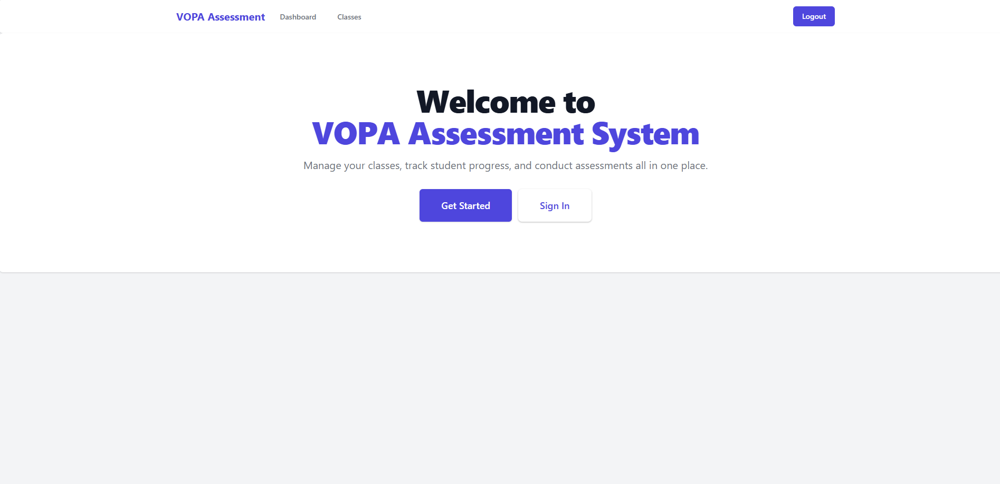
*Overview of class performance and quick access to assessment tools*

2. Student Assessment Interface

*Interactive assessment interface with real-time feedback*

3. Progress Analytics
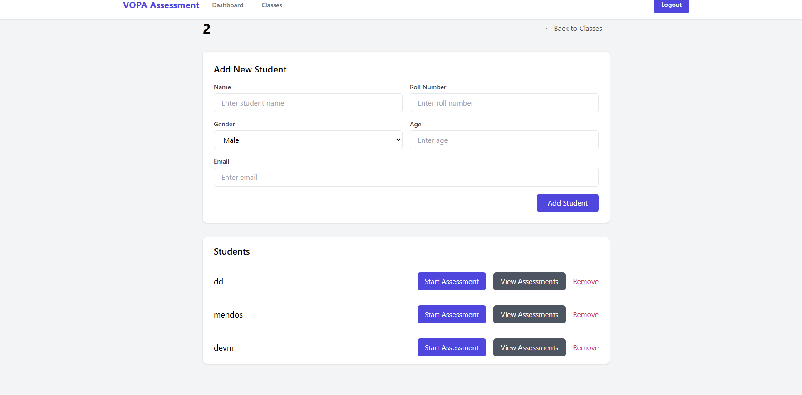
*Detailed student progress tracking and performance metrics*

4. Assessment History
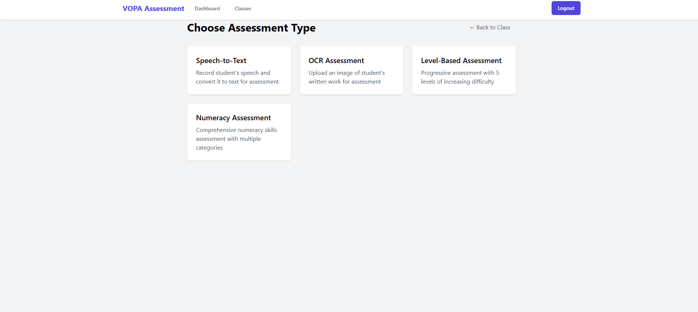
*Comprehensive view of student assessment history*

5. Class Management
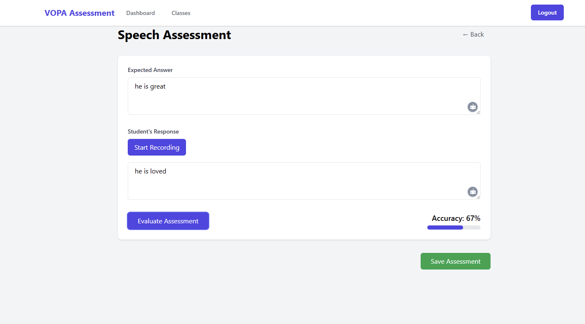


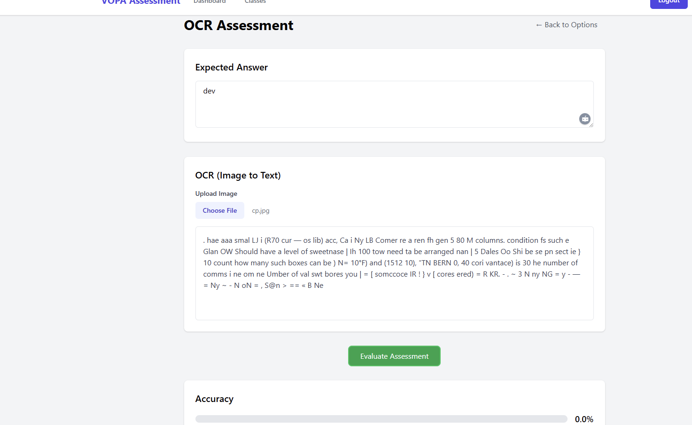
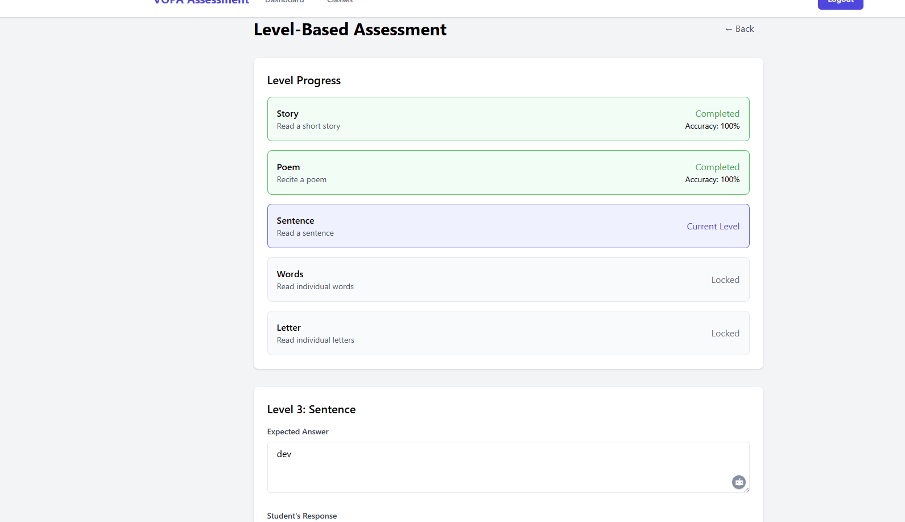
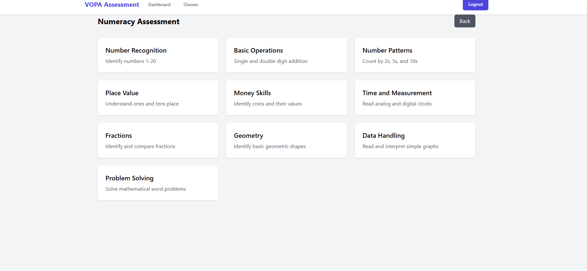
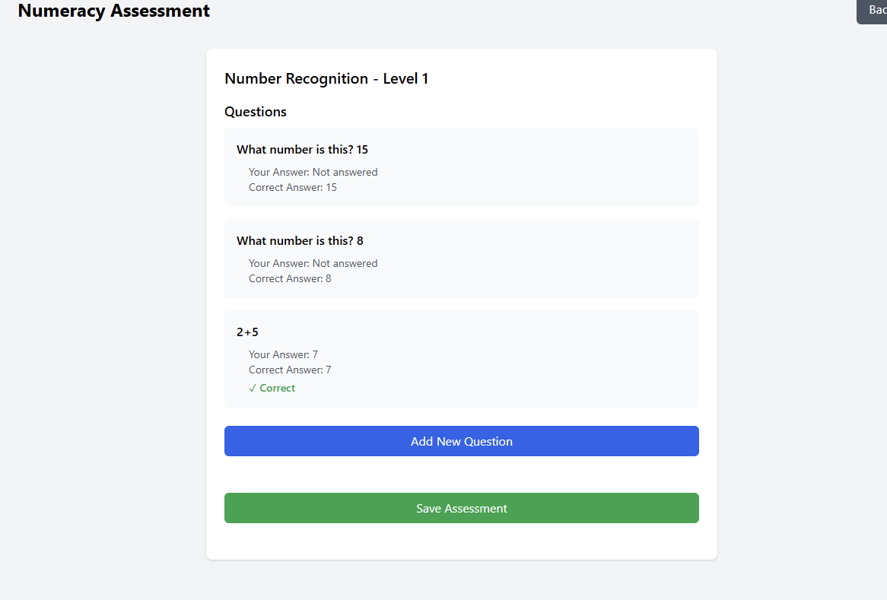
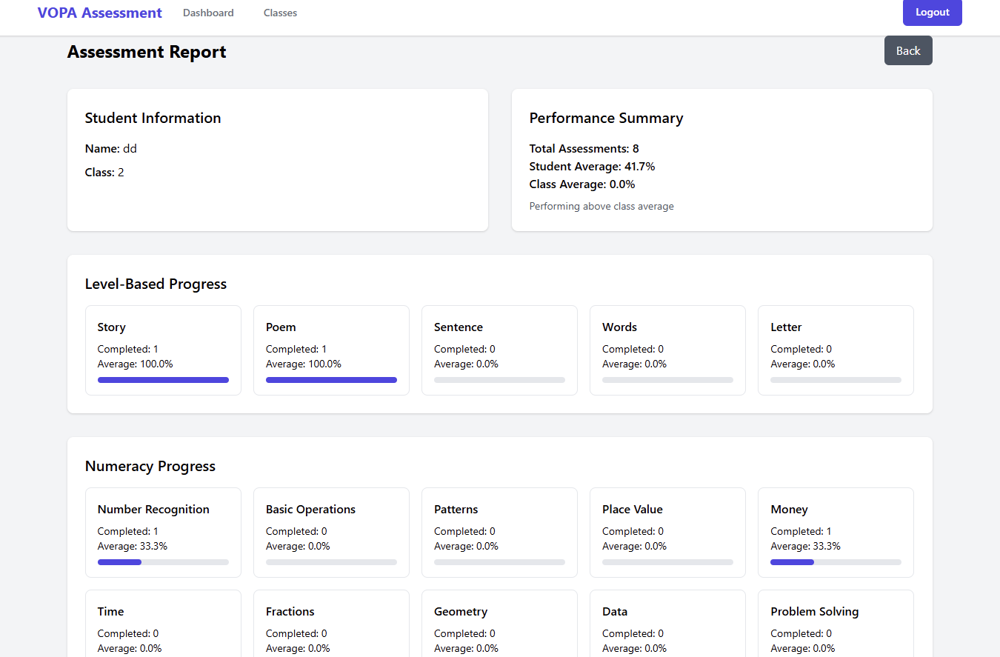
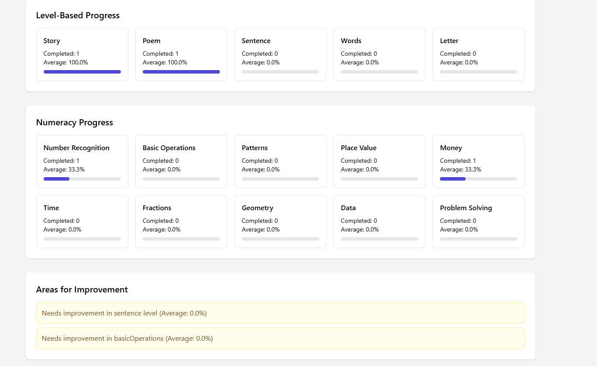
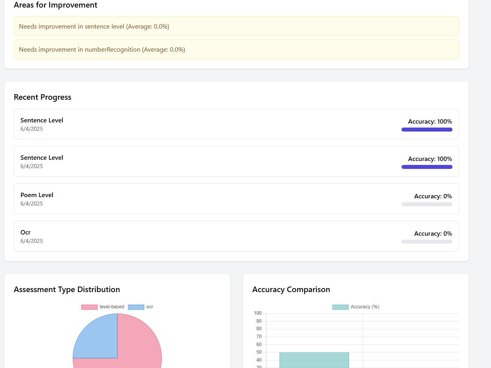
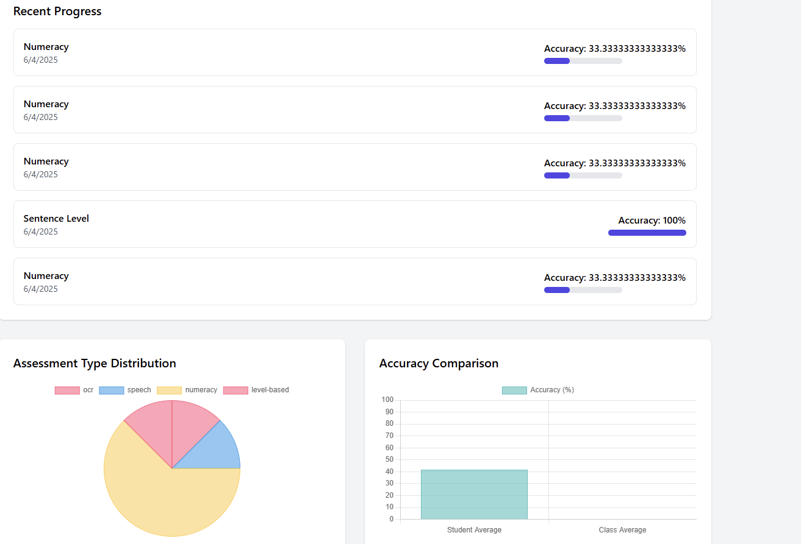


